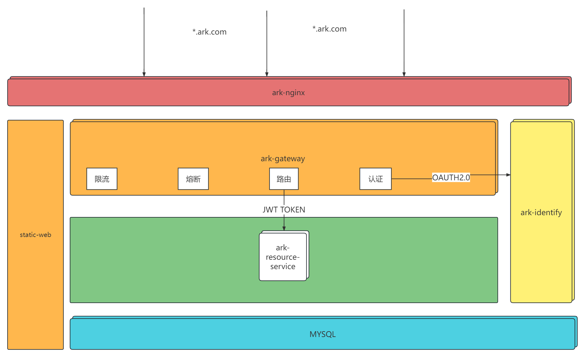

# 方舟

# 系统架构图

## 一、逆向工程
### 领域项目模板（待考量）
### 依托mybatis-plus代码生成工具开发(开发中)

## 二、统一用户中心（idaas）
- 认证子领域
- 用户子领域
- 角色子领域
- 资源外部领域（面向接口）

## deploy
 1. 配置hosts文件添加 localhost.hosts配置
 2. 运行[docker-compose.yml](docker-compose.yml)

